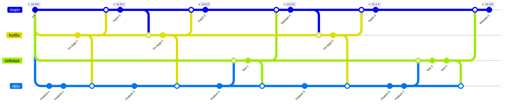

# Git Branching Strategy 
| สาขา (Branch)      | วัตถุประสงค์ (Purpose)                                                       |
|-------------|-----------------------------------------------------------------|
| `main`      | สำหรับเก็บโค้ดที่เสถียรและพร้อมใช้งานในระบบจริง (production) โดยจะเก็บเวอร์ชันที่ปล่อยให้ใช้งานด้วย  |
| `dev`       | สำหรับการรวมฟีเจอร์ต่าง ๆ และเป็นพื้นที่หลักของการพัฒนา   |
| `hotfix`    | สำหรับการแก้ไขปัญหาสำคัญแบบเร่งด่วนที่นำไปใช้กับระบบจริง (main) โดยตรง      | 
| `release`    | สำหรับทดสอบฟีเจอร์ต่าง ๆที่พัฒนามาก่อนที่จะปล่อยให้ใช้งานในระบบจริง (production)      | 

